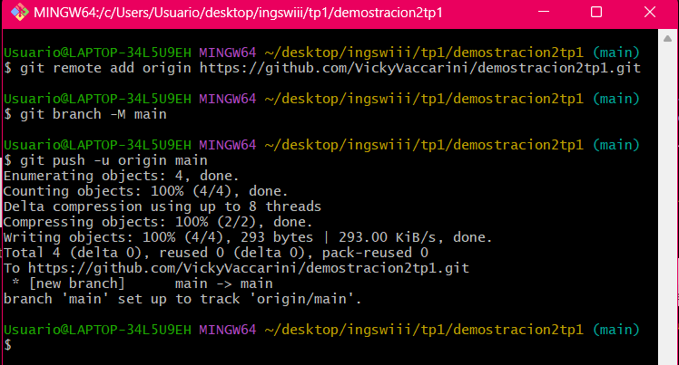
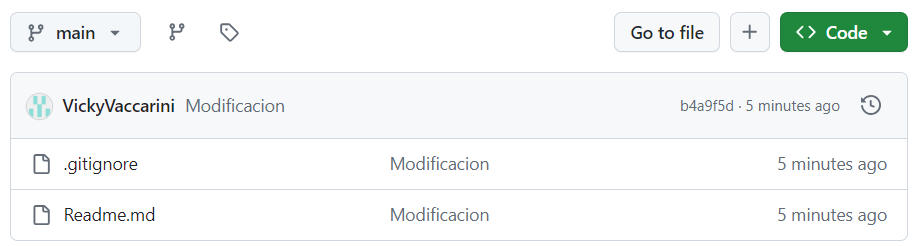

## **TRABAJO PRACTICO 1** 
### Creación de Repos 1
#### 1. Crear Repo en GitHub.

#### 2. Clonarlo localmente.

#### 3. Editar archivo Readme.md, agregar algunas líneas con texto a dicho archivo.

#### Verifico el cambio con un git status

#### 4.	Editar (crearlo si no existe) el archivo .gitignore. Agregar *.bak

#### 5. Crear un commit y proveer un mensaje descriptivo.

#### 6. Hacer un push al repositorio remoto

### Creación de clave SSH
#### 1. Ir al directorio ssh y generar una clave usando el mail de la cuenta de GitHub

#### 2.	Abrir el archivo id_rsa.pub con el editor y copiar todo el contenido
#### 3. En la cuenta de GitHub ir a Settings SSH y crear una nueva clave con el contenido copiado.

#### 4. Verficar conexión

### Creación de Repos 2
#### 1.	Crear un repositorio local en un nuevo directorio.
#### 2.	Crear archivo .gitignore.

#### 3.	Agregar archivo Readme.md, agregar algunas líneas con texto a dicho archivo.

#### 4.	Crear un commit y proveer un mensaje descriptivo.

#### 5.	Crear repo en github.

#### 6.	Asociar local con remoto.

### Ramas
#### 1.	Crear una nueva rama
#### 2.	Cambiarse a esa rama

#### 3.	Hacer un cambio en el archivo Readme.md y hacer commit

#### 4. Revisar la diferencia entre ramas

### Merge
#### 1. Hacer un merge FF (fast-forward)

#### 2. Borrar la rama creada

#### 3. Ver el log de commits

#### 4. Repetir el ejercicio 6 para poder hacer un merge con No-FF 

##### Luego realicé un git merge --no-ff newFeature

### Resolución de conflictos
#### 1.	Crear una nueva rama conflictBranch

#### 2. Realizar una modificación en la linea 1 del Readme.md desde main y commitear

##### Acá realicé el cambio de la línea desde el main
#### 3. En la conflictBranch modificar la misma línea del Readme.md y commitear

#### 4.	Ver las diferencias con git difftool main conflictBranch

#### 5.	Cambiarse a la rama main e intentar mergear con la rama conflictBranch
#### 6.	Resolver el conflicto con git mergetool

#### 7.	Agregar .orig al .gitignore
#### 8.	Hacer commit y push
##### Realice echo "*.orig" >> .gitignore 

### Pull Request
#### 1. Explicar que es un pull request.
##### Un Pull Request es una solicitud que alguien que ha hecho una copia (fork) de un repositorio de código hace al dueño del repositorio original, pidiendo que los cambios que ha hecho en su copia sean añadidos al proyecto original.
##### EJEMPLO: user2 ha hecho cambios en su copia del repositorio y ahora le está pidiendo a user1 (el dueño del repositorio original) que incorpore esos cambios en el proyecto principal.
#### 2.	Crear un branch local y agregar cambios a dicho branch.

#### 3.	Subir el cambio a dicho branch y crear un pull request.
#### 4.	Completar el proceso de revisión en github y mergear el PR al branch master.

