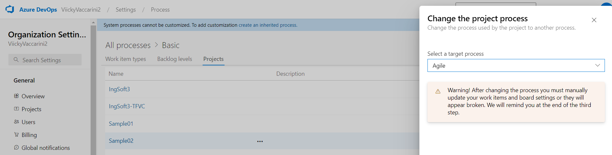
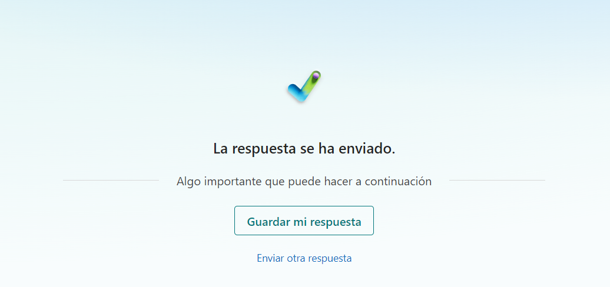
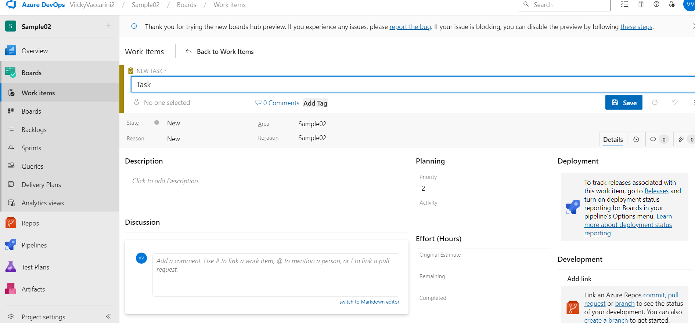

## **TRABAJO PRACTICO 3** 
### ¿Qué es Azure DevOps?: 
#### Es un conjunto de herramientas de Microsoft diseñado para la colaboración en el desarrollo de software. Facilita la planificación, el desarrollo, la entrega y el monitoreo de aplicaciones, integrando todo el ciclo de vida del desarrollo de software. Está especialmente orientado a la integración continua (CI), la entrega continua (CD) y la gestión de proyectos, con un enfoque en la colaboración entre equipos.

### Beneficios de utilizar Azure DevOps
#### 1.	Integración Completa: Azure DevOps ofrece una plataforma unificada que cubre todo el ciclo de vida de desarrollo, desde la planificación hasta la entrega.
#### 2.	Flexibilidad: Compatible con diversas tecnologías y lenguajes de programación, y permite integrarse con herramientas externas como GitHub, Jenkins, Docker y Kubernetes.
#### 3.	Escalabilidad: Azure DevOps es altamente escalable, ideal tanto para startups como para grandes empresas.
#### 4.	Flujo de Trabajo Ágil: Ofrece funcionalidades nativas para gestionar proyectos con metodologías ágiles como Scrum y Kanban.
#### 5.	Automatización Eficiente: Facilita la automatización a través de pipelines, mejorando la eficiencia en la construcción, prueba y despliegue de aplicaciones.

### Componentes Principales de Azure DevOps
#### 1.	Azure Repos: Sistema de control de versiones que admite Git (distribuido) o TFVC (Team Foundation Version Control, centralizado).
####     •	Funcionalidades clave: Gestión de ramas (branching). Pull requests para revisión de código. Revisiones de código y colaboración en equipo.
#### 2.	Azure Pipelines: Plataforma de CI/CD que soporta la automatización de builds, pruebas y despliegues.
####     •	Funcionalidades clave: Creación y gestión de pipelines para integrar y desplegar código automáticamente. Compatibilidad con múltiples plataformas y lenguajes (Windows, Linux, macOS). Despliegue continuo en entornos locales o en la nube.
#### 3.	Azure Boards: Herramienta para la gestión de proyectos ágil con soporte para Kanban y Scrum.
####     •	Funcionalidades clave: Seguimiento de tareas, bugs y work items. Visualización del progreso del proyecto mediante paneles personalizables. Gestión de sprints y backlog.
#### 4.	Azure Artifacts: Servicio de gestión de paquetes para compartir y distribuir artefactos como NuGet, npm o Maven.
####     •	Funcionalidades clave: Feeds privados para compartir paquetes de manera segura entre equipos. Integración con pipelines para la publicación automática de paquetes.
#### 5.	Azure Test Plans: Herramienta para la gestión de pruebas manuales y automatizadas.
####     •	Funcionalidades clave: Creación y ejecución de casos de prueba. Reportes detallados de resultados y calidad. Planificación de pruebas y gestión de defectos.

### Integración con otras herramientas: 
#### Azure DevOps se integra fácilmente con una amplia gama de herramientas externas como:
#### •	GitHub: Sincronización de repositorios y pipelines.
#### •	Jenkins: Integración para despliegue y automatización.
#### •	Docker y Kubernetes: Despliegue de aplicaciones en contenedores y orquestación.

### Marketplace de extensiones:
#### Azure DevOps cuenta con un marketplace que permite añadir funcionalidades adicionales mediante extensiones, personalizando y ampliando la experiencia según las necesidades del equipo o proyecto.

#### 1. Crear una cuenta en Azure DevOps

#### 2. Crear un proyecto Sample01

#### 3. Crear un repo GIT desde cero

#### 4. Crear un proyecto Sample02

#### Cambié la privacidad de la organización

#### Pasé a públicos los proyectos

#### 5. Importar un repo desde GitHub: https://github.com/ingsoft3ucc/SimpleWebAPI.git

#### 6. Realizar un cambio en un archivo, y subirlo al repo de ADO.

#### 7. Cambiar el tipo de proceso de Basic a Agile

#### 8. Crear un pipeline, solicitar acceso a jobs de paralelismo

#### Se eligió Azure Repos Git, y luego, en la configuración, se seleccionó ASP NET CORE (.NET Framework)

#### Pipeline corriendo

#### 9. Crear un sprint
#### Al sprint que ya tenía, le agregué fechas. 

#### Realice un nuevo sprint

#### 10. Crear User Stories

#### 11. Crear Tasks y Bugs

