## **TRABAJO PRACTICO 4** 
### Azure DevOps Pipelines
#### Es un servicio de integración continua (CI) y entrega continua (CD) que permite compilar, probar y desplegar código automáticamente en diferentes entornos. Soporta múltiples lenguajes y plataformas, con integración para repositorios como GitHub y Azure Repos.

#### Tipos de Pipelines
#### - Build Pipelines: Compilan y empaquetan el código fuente, transformándolo en artefactos listos para desplegar.
#### - Deploy Pipelines (Release Pipelines): Despliegan los artefactos construidos en diferentes entornos como desarrollo, staging y producción.

#### Diferencias entre Editor Clásico y YAML
#### - Editor Clásico: Ofrece una interfaz gráfica para configurar pipelines sin escribir código, ideal para quienes prefieren un enfoque visual.
#### - Editor YAML: Define pipelines en un archivo de texto con un enfoque declarativo, permitiendo configuraciones avanzadas y facilitando el versionado junto al código fuente.

#### Agentes de Ejecución
#### - Agentes Microsoft-Hosted: Gestionados por Microsoft, preconfigurados con herramientas comunes y escalables para la mayoría de los casos de uso estándar.
#### - Agentes Self-Hosted: Configurados en servidores propios, ofreciendo mayor control y personalización, ideales para entornos específicos o necesidades especiales de ejecución sin depender de la infraestructura de Microsoft.

#### 1. Verificar acceso a Pipelines concedido

#### 2. Agregar en pipeline YAML una tarea de Publish.

#### 3. Explicar por qué es necesario contar con una tarea de Publish en un pipeline que corre en un agente de Microsoft en la nube.
#### Cuando se ejecuta un pipeline en un agente en la nube, los archivos generados solo persisten durante la ejecución del pipeline. Para poder descargarlos o reutilizarlos en otros pipelines, es necesario publicarlos como artefactos. Esto permite almacenar temporalmente los resultados y acceder a ellos en etapas posteriores o desde la interfaz web.

#### 4. Descargar el resultado del pipeline y correr localmente el software compilado.
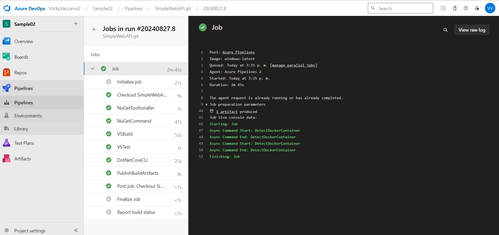
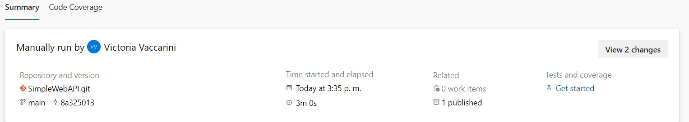
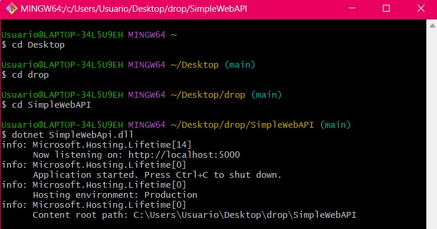

#### 5. Habilitar el editor clásico de pipelines. Explicar las diferencias claves entre este tipo de editor y el editor YAML.
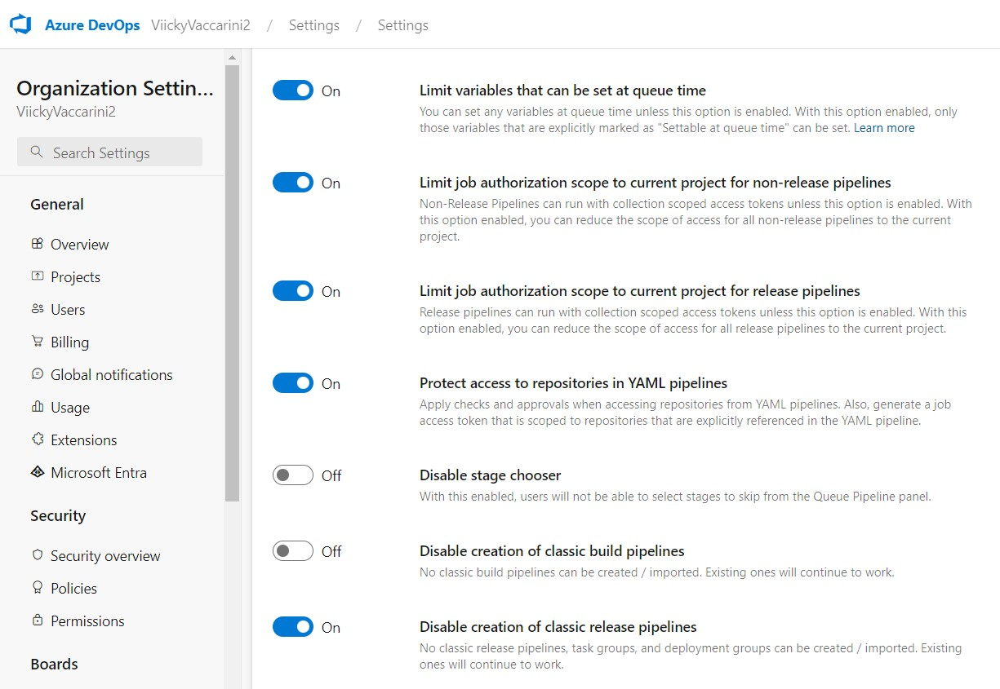
#### En el Editor Clásico, los pipelines se configuran mediante una interfaz gráfica, lo cual es fácil para usuarios menos técnicos pero ofrece menos flexibilidad y personalización. No se integra con control de versiones y está siendo descontinuado.
#### El Editor YAML utiliza archivos YAML dentro del repositorio, permitiendo versionar, personalizar y reutilizar pipelines fácilmente. Es más flexible y soporta scripts y configuraciones avanzadas. Además, cuenta con soporte continuo y es la opción preferida por Microsoft para futuros desarrollos.
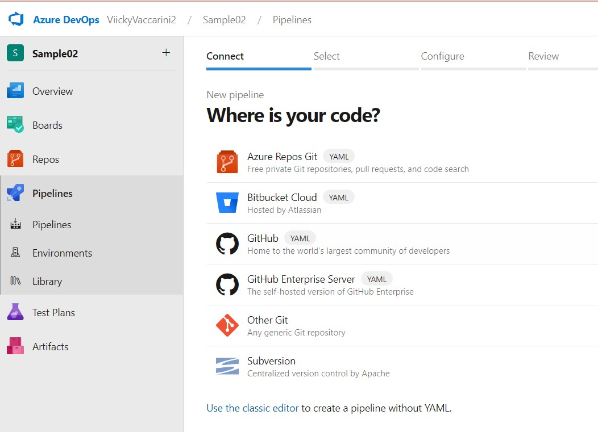

#### 6. Crear un nuevo pipeline con el editor clásico. Descargar el resultado del pipeline y correr localmente el software compilado.
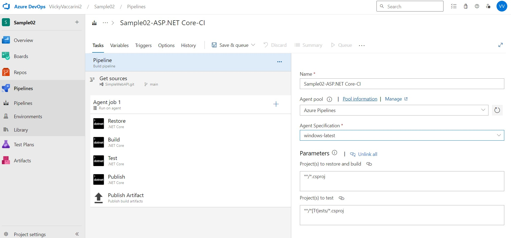
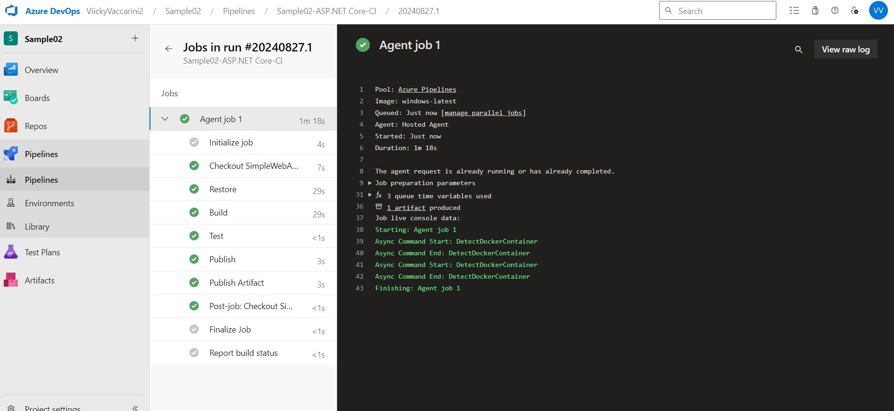
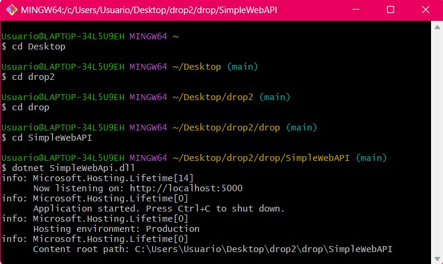

#### 7. Configurar CI en ambos pipelines (YAML y Classic Editor). Mostrar resultados de la ejecución automática de ambos pipelines al hacer un commit en la rama main.
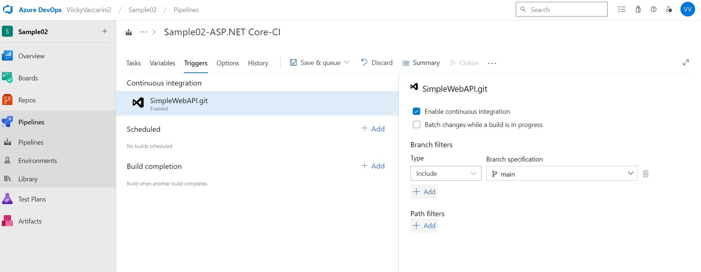
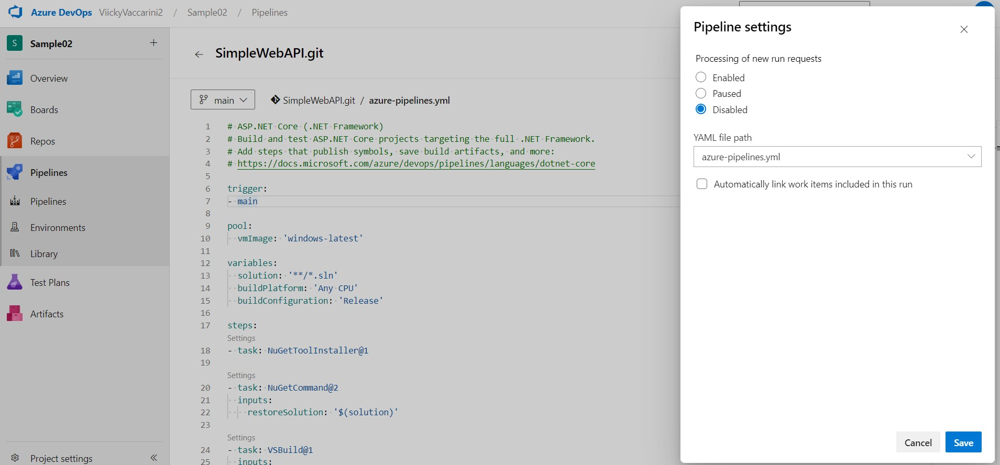

#### 8. Explicar la diferencia entre un agente MS y un agente Self-Hosted. ¿Qué ventajas y desventajas hay entre ambos? Cuándo es conveniente y/o necesario usar un Self-Hosted Agent? 
#### Los Agentes MS (Microsoft-Hosted) son agentes gestionados por Microsoft que ofrecen una configuración simplificada, escalabilidad automática y mantenimiento gestionado, lo que facilita la implementación y uso. Sin embargo, tienen limitaciones en cuanto a configuraciones específicas y no permiten una personalización completa del entorno.
#### Los Agentes Self-Hosted son agentes que se configuran en servidores propios, lo que brinda control total sobre el entorno, permitiendo una personalización completa y el uso de software propietario o herramientas que no están disponibles en los agentes MS. La desventaja principal es la mayor complejidad en la configuración y el mantenimiento, ya que requieren gestionar la infraestructura y las actualizaciones manualmente.

#### Es conveniente usar un agente Self-Hosted cuando se requiere un entorno específico, herramientas particulares no soportadas por los agentes MS, o cuando se necesita trabajar en un entorno aislado o con software propietario que no puede ser compartido en un entorno gestionado por terceros.

#### Crear un Pool de Agentes y un Agente Self-Hosted
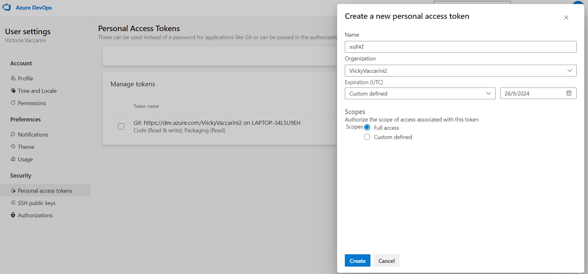
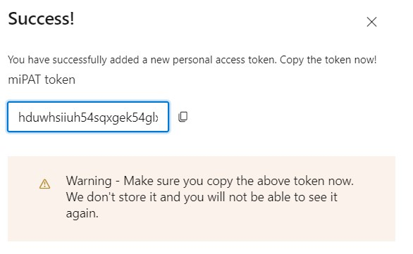
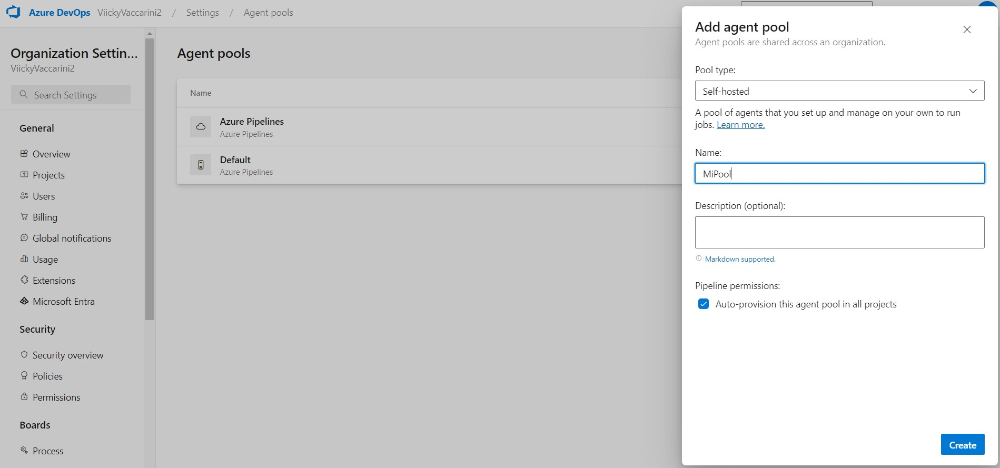

#### 9. Instalar y correr un agente en nuestra máquina local.
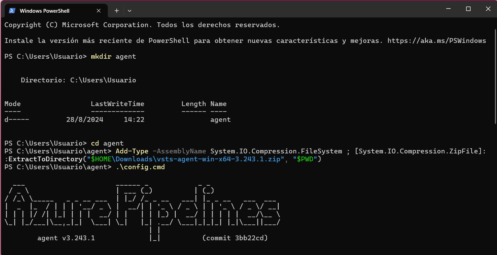
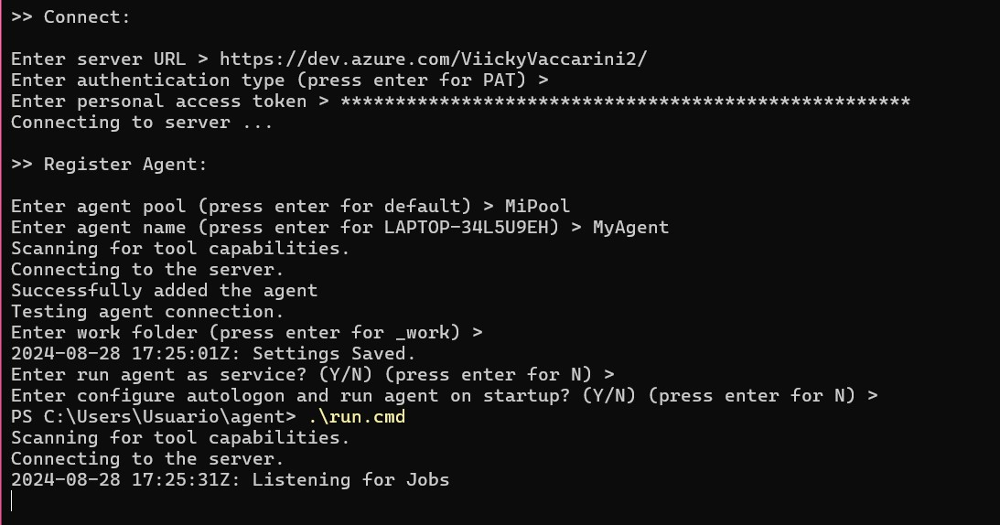
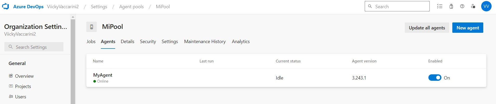

#### 10. Crear un pipeline que use el agente Self-Hosted alojado en nuestra máquina local.
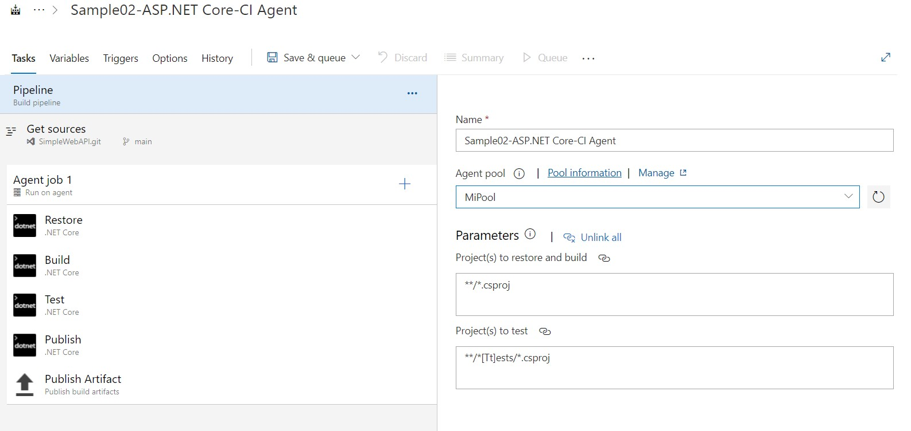

#### 11. Buscar el resultado del pipeline y correr localmente el software compilado.
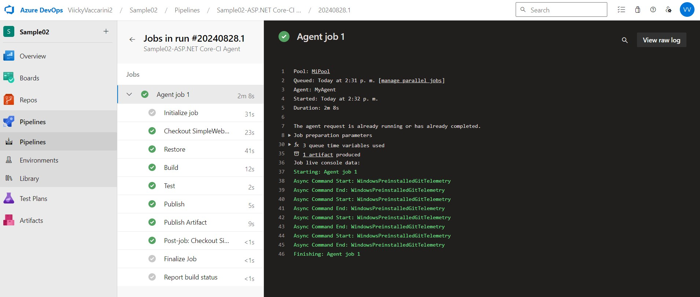
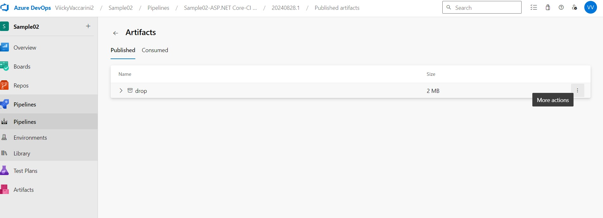
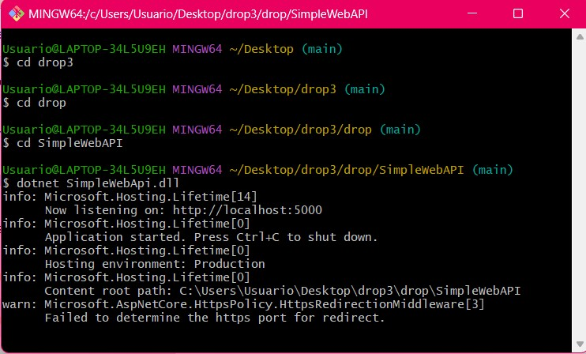
