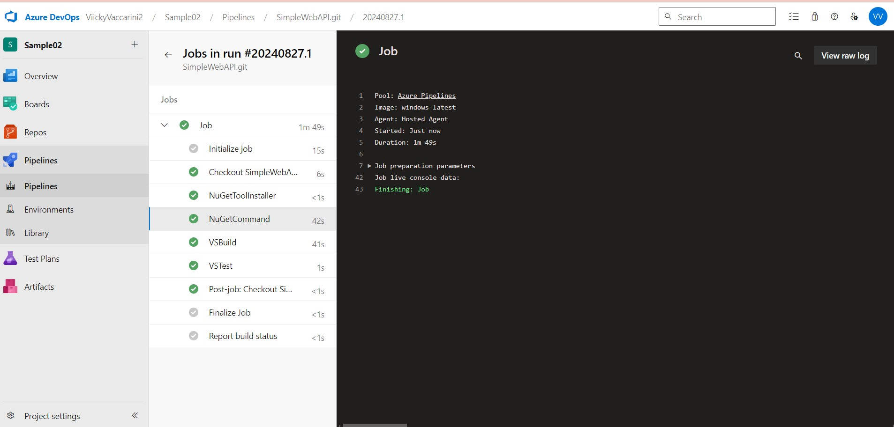
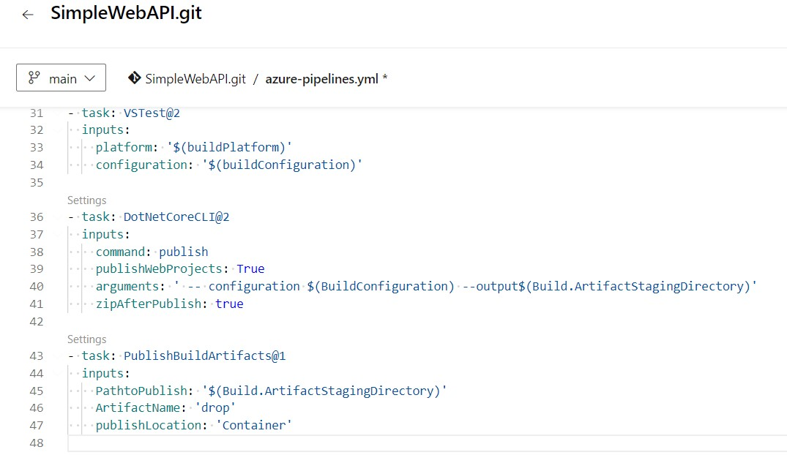

## **TRABAJO PRACTICO 4** 
### Azure DevOps Pipelines
#### Es un servicio de integración continua (CI) y entrega continua (CD) que permite compilar, probar y desplegar código automáticamente en diferentes entornos. Soporta múltiples lenguajes y plataformas, con integración para repositorios como GitHub y Azure Repos.

#### Tipos de Pipelines
#### - Build Pipelines: Compilan y empaquetan el código fuente, transformándolo en artefactos listos para desplegar.
#### - Deploy Pipelines (Release Pipelines): Despliegan los artefactos construidos en diferentes entornos como desarrollo, staging y producción.

#### Diferencias entre Editor Clásico y YAML
#### - Editor Clásico: Ofrece una interfaz gráfica para configurar pipelines sin escribir código, ideal para quienes prefieren un enfoque visual.
#### - Editor YAML: Define pipelines en un archivo de texto con un enfoque declarativo, permitiendo configuraciones avanzadas y facilitando el versionado junto al código fuente.

#### Agentes de Ejecución
#### - Agentes Microsoft-Hosted: Gestionados por Microsoft, preconfigurados con herramientas comunes y escalables para la mayoría de los casos de uso estándar.
#### - Agentes Self-Hosted: Configurados en servidores propios, ofreciendo mayor control y personalización, ideales para entornos específicos o necesidades especiales de ejecución sin depender de la infraestructura de Microsoft.

#### 1. Verificar acceso a Pipelines concedido

#### 2. Agregar en pipeline YAML una tarea de Publish.

#### 3. Explicar por qué es necesario contar con una tarea de Publish en un pipeline que corre en un agente de Microsoft en la nube.
#### Cuando se ejecuta un pipeline en un agente en la nube, los archivos generados solo persisten durante la ejecución del pipeline. Para poder descargarlos o reutilizarlos en otros pipelines, es necesario publicarlos como artefactos. Esto permite almacenar temporalmente los resultados y acceder a ellos en etapas posteriores o desde la interfaz web.

#### 4. Descargar el resultado del pipeline y correr localmente el software compilado.

