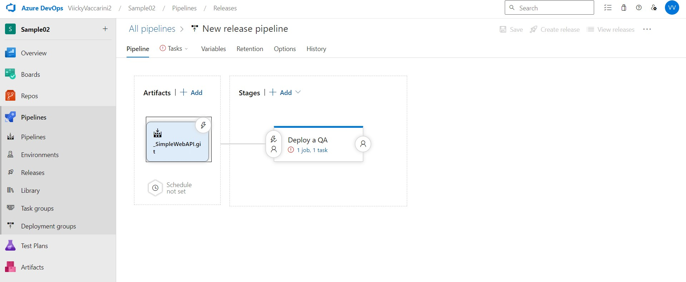
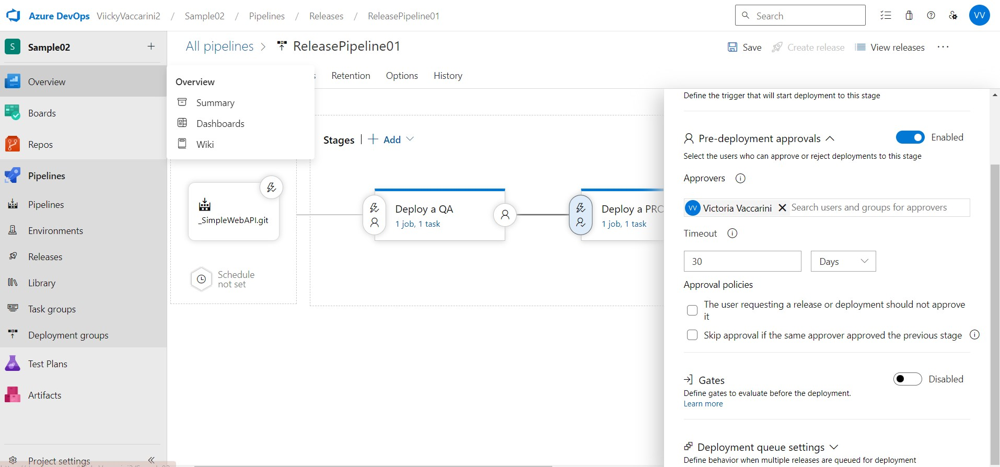

## **TRABAJO PRACTICO 5** 

#### 1. Crear una cuenta en Azure

#### 2. Crear un recurso Web App en Azure Portal y navegar a la url provista

#### 3. Actualizar Pipeline de Build para que use tareas de DotNetCoreCLI@2 como en el pipeline clásico, luego crear un Pipeline de Release en Azure DevOps con CD habilitada

#### Creamos un pipeline de release

#### Le cambio el nombre

#### 4. Optimizar Pipeline de Build. 
#### El pipeline del build ya está optimizado (.yaml que nos pasó el profe)

#### 5. Verificar el deploy en la url de la WebApp /weatherforecast

#### 6. Realizar un cambio al código del controlador para que devuelva 7 pronósticos, realizar commit, evaluar ejecución de pipelines de build y release, navegar a la url de la webapp/weatherforecast y corroborar cambio

#### Luego del commit se ejecutan los pipelines y vemos que lo hacen de forma correcta

#### Vemos que están los 7 pronósticos

#### 7. Clonar la Web App de QA para que contar con una WebApp de PROD a partir de un Template Deployment en Azure Portal y navegar a la url provista para la WebApp de PROD.

#### 8. Agregar una etapa de Deploy a Prod en Azure Release Pipelines

#### 9. Realizar un cambio al código del controlador para que devuelva 10 pronósticos, realizar commit, evaluar ejecución de pipelines de build y release, navegar a la url de la webapp/weatherforecast y corroborar cambio, verificar que en la url de la webapp_prod/weatherforecast se muestra lo mismo. 

#### Vemos que en el QA aparecen los 10 pronósticos

#### Y también vemos que aparecen en el PROD

#### 10. Modificar pipeline de release para colocar una aprobación manual para el paso a Producción.

#### 11. Realizar un cambio al código del controlador para que devuelva 5 pronósticos, realizar commit, evaluar ejecución de pipelines de build y release, navegar a la url de la webapp/weatherforecast y corroborar cambio, verificar que en la url de la webapp_prod/weatherforecast aun se muestra la versión anterior.

#### Vemos que solo se actualizó en el QA

#### 12. Aprobar el pase ya sea desde el release o desde el mail recibido.

#### Se hizo el deploy a PROD

#### Notar que se puede dar la aprobación, pero posponer su aplicación hasta una determinada fecha

#### 13. Esperar a la finalización de la etapa de Pase a Prod y luego corroborar que en la url de la webapp_prod/weatherforecast se muestra la nueva versión coinicidente con la de QA.

#### 14. Realizar un pipeline (no release) que incluya el deploy a QA y a PROD con una aprobación manual. El pipeline debe estar construido en YAML sin utilizar el editor clásico de pipelines ni el editor clásico de pipelines de release.

