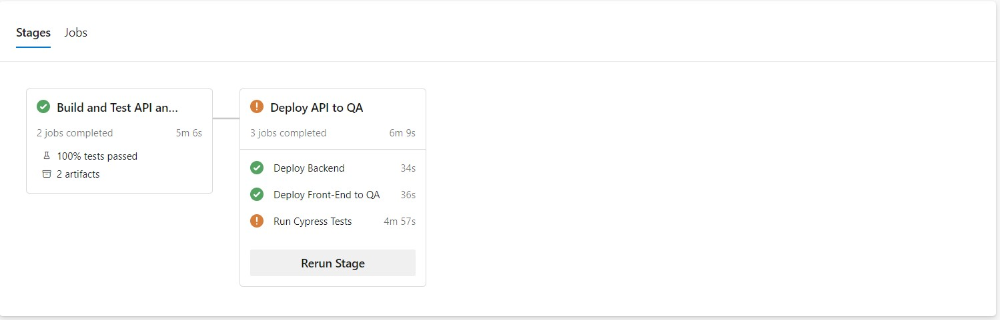
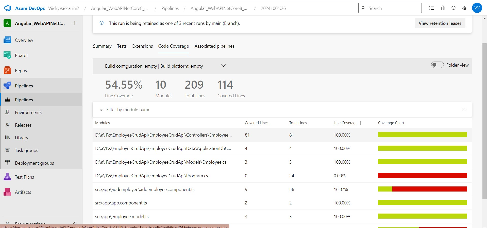
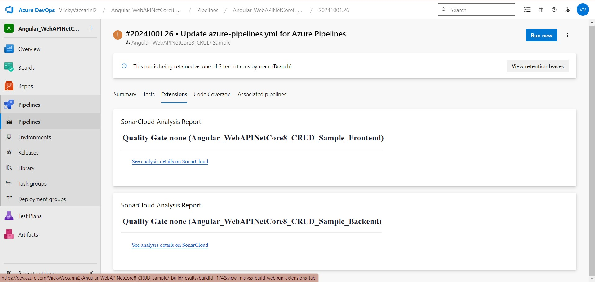

## **TRABAJO PRACTICO 7** 

#### 4.1 Agregar Code Coverage a nuestras pruebas unitarias de backend y front-end e integrarlas junto con sus resultados en nuestro pipeline de build.
#### •	Desarrollo del punto 4.1:
#### o	4.1.1 En el directorio raiz de nuestro proyecto Angular instalar el siguiente paquete:

#### o	4.1.2 Editar nuestro archivo karma.conf.js para que incluya reporte de cobertura

#### o	4.1.3 En el dir raiz del proyecto EmployeeCrudApi.Tests ejecutar:

#### o	4.1.4 Agregar a nuestro pipeline ANTES del Build de Back la tarea de test con los argumentos especificados y la de publicación de resultados de cobertura.

#### o	4.1.5 Agregar a nuestro pipeline ANTES del Build de front la tarea de test y la de publicación de los resultados.

#### o	4.1.6 Ejecutar el pipeline y analizar el resultado de las pruebas unitarias y la cobertura de código.

 
#### •	Desarrollo del punto 4.2: Demostración de cómo integrar SonarCloud en un pipeline de CI/CD y cómo leer los reportes de análisis estático.

#### o	4.2.1 Integraremos SonarCloud para analizar el código fuente. Configurar SonarCloud en nuestro pipeline siguiendo instructivo 5.1
#### -	Antes de nuestra tarea de Build del Back:

#### -	Despues de nuestra tarea de Build del Back:

#### o	4.2.2 Vemos el resultado de nuestro pipeline, en extensions tenemos un link al análisis realizado por SonarCloud

#### o	4.2.3 Ir al link y analizar toda la información obtenida. Detallar en la entrega del TP los puntos más relevantes del informe, qué significan y para qué sirven.

#### El informe de SonarCloud actúa como un escáner del código, proporcionando una evaluación exhaustiva de la calidad del software y la deuda técnica. Identifica problemas como bugs, vulnerabilidades, code smells y duplicados, que afectan el rendimiento y la seguridad de la aplicación. Además, analiza la cobertura de pruebas, resaltando la importancia de tener un alto porcentaje de código cubierto por pruebas automatizadas de calidad. Agrupa los problemas en categorías de Mantenibilidad, Fiabilidad y Seguridad, permitiendo detectar y priorizar arreglos críticos para optimizar el código y facilitar su mantenimiento a largo plazo. En última instancia, SonarCloud no solo ayuda a identificar defectos, sino que también establece un marco para monitorear la calidad del código de forma continua, mejorando así la seguridad y la sostenibilidad del proyecto.

#### 4.3 Pruebas de Integración con Cypress:
#### o	4.3.1 En el directorio raiz de nuestro proyecto Angular instalar el siguiente paquete:

#### o	4.3.2 Abrir Cypress:

#### o	4.3.3 Inicializar Cypress en nuestro proyecto como se indica en el instructivo 5.2

#### o	4.3.4 Crear nuestra primera prueba navegando a nuestro front.

#### o	4.3.5 Correr nuestra primera prueba

#### Si está abierta la interfaz gráfica de Cypress, aparecerá el archivo primer_test.cy.js en la lista de pruebas. Clic en el archivo para ejecutar la prueba. 

#### También es posible ejecutar Cypress en modo "headless" (sin interfaz gráfica) utilizando el siguiente comando: npx cypress run

#### o	4.3.6 Modificar nuestra prueba para que falle.
#### -	Editamos el archivo primer_test.cy.js y hacemos que espere otra cosa en el título

#### -	Ejecutamos cypress en modo headless

#### Cypress captura automáticamente pantallas cuando una prueba falla. Las capturas de pantalla se guardan en la carpeta cypress/screenshots.
#### o	4.3.6 Grabar nuestras pruebas para que Cypress genere código automático y genere reportes: Cerramos Cypress
#### o	Editamos el archivo cypress.config.ts incluyendo la propiedad experimentalStudio en true y la configuración de reportería.
 
#### -	Corremos nuevamente Cypress con npx cypress open, una vez que se ejecute nuestra prueba tendremos la opción de "Add Commands to Test". Esto permitirá interactuar con la aplicación y generar automáticamente comandos de prueba basados en las interacciones con la página:
 
#### -	Por ejemplo, si agregamos un nuevo empleado y luego verificamos que esté en la lista, Cypress nos generará un código como este:

#### o	Por supuesto que habrá que hacerle ajustes, como por ejemplo que se fije siempre en la última fila de la grilla y no en la posición 15 como lo grabó, es ahí cuando consultando la documentación de Cypress debemos ver cómo modificar el código, en nuestro caso de ejemplo sería así:

#### o	4.3.7 Hacemos prueba de editar un empleado
#### -	Creamos en cypress/e2e/ un archivo editEmployee_test.cy.js con el siguiente contenido, guardamos y aparecerá en Cypress:
 

#### -	Hacemos "Add command to the test" y empezamos a interactuar con la página
#### o	Hacemos algunos ajustes al código generado:

#### 4.4 Desafíos:
#### •	Integrar en el pipeline SonarCloud para nuestro proyecto Angular, mostrar el resultado obtenido en SonarCloud
 

 
#### •	Implementar en Cypress pruebas de integración que incluya los casos desarrollados como pruebas unitarias del front en el TP06.
 

 

 

 

 

 

#### •	Incorporar al pipeline de Deploy la ejecución de las pruebas de integración y la visualización de sus resultados.
#### •	Resultado esperado:
#### o	Un Pipeline en YAML que incluya a) Build de QA y Front con ejecución y resultado de pruebas de code coverage, pruebas unitarias y análisis de Sonar Cloud y b) Deploy a WebApp(s) de QA y Front que incluya ejecución y resultado de pruebas de integración

#### o	Dos Stages: Una para Build, Test Unitarios, Code Coverage y SonarCloud y otra para el Deploy a QA con Tests de Integración

#### o	En la pestaña Test, poder visualizar los Test Unitarios de Front y Back y los Test de Integracion:

#### o	En la pestaña Code Coverage, visualizar la cobertura de las pruebas unitarias de Back y de Front:

#### o	En la pestaña Extensions, ver el análisis de SonarCloud en verde
 

#### 4.4.4 Un documento de una carilla explicando qué información pudieron sacar del análisis de Sonar Cloud y de las pruebas de cobertura.
#### Calidad del Código: El análisis de SonarCloud reveló varias métricas clave sobre la calidad del código:
#### •	Vulnerabilidades: Se identificaron vulnerabilidades que requieren atención para mitigar riesgos de seguridad en la aplicación. 
#### •	Deuda Técnica: El análisis mostró que la deuda técnica está presente, lo cual afecta la mantenibilidad y escalabilidad del proyecto. 
#### Metrologías de Cobertura. Los resultados de las pruebas de cobertura indican lo siguiente:
#### •	Cobertura Total: La cobertura total del código es del 54.55%, lo que significa que, de un total de 209 líneas de código, se han ejecutado 114 líneas durante las pruebas.
#### •	Cobertura por Módulo: Se presentan los resultados de cobertura de algunos módulos críticos:

##### o	Los controladores tienen una cobertura del 100%, lo cual es excelente y muestra que todas las rutas de este módulo están siendo probadas adecuadamente.
##### o	Sin embargo, el archivo Program.cs presenta una cobertura del 0%, lo que indica que no se están ejecutando pruebas en este módulo. Es crucial agregar pruebas para este archivo para mejorar la cobertura total.
##### o	El componente addemployee.component.ts tiene una baja cobertura del 16.07%, lo que sugiere que muchas de sus funcionalidades no están siendo probadas. Se recomienda crear más pruebas para cubrir los casos de uso de este componente.

