## Trabajo Práctico 9
### Actividad
##### 1. Modificar nuestro pipeline para incluir el deploy en QA y PROD de Imagenes Docker en Servicio Azure App Services con Soporte para Contenedores
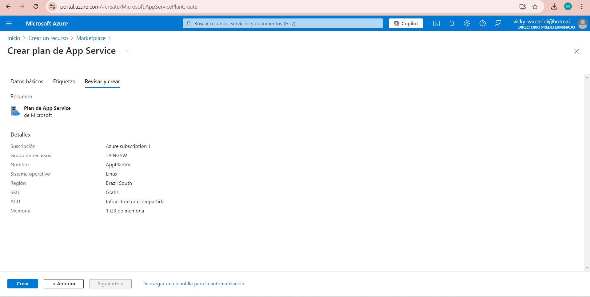
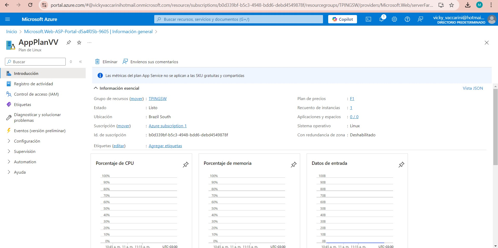
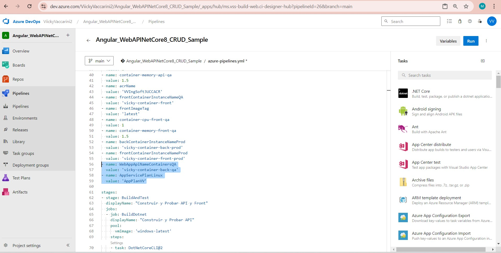
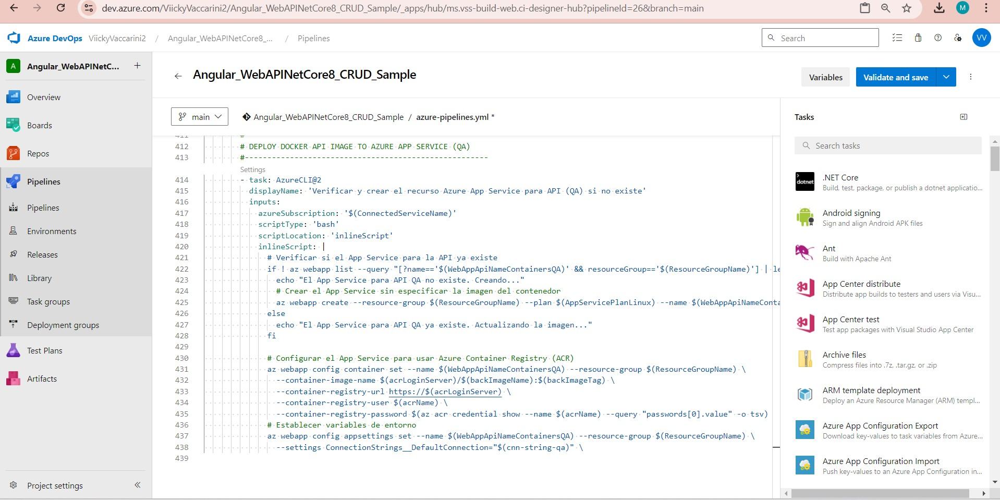

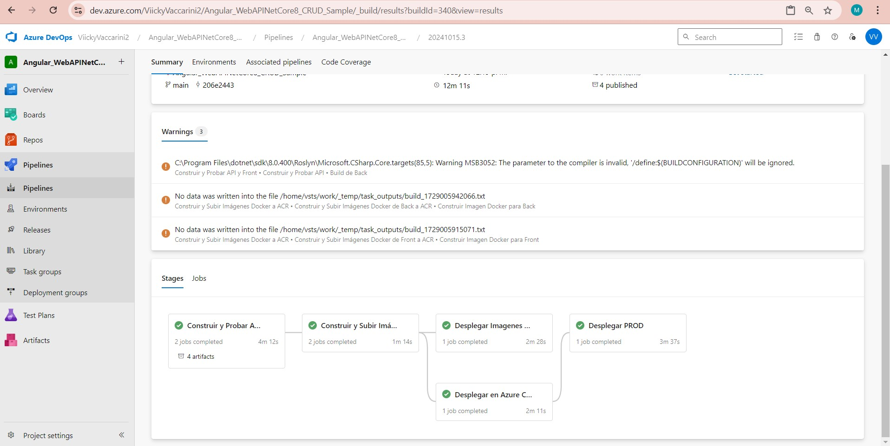
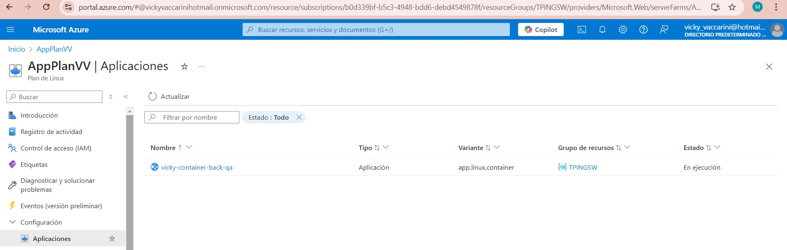

### Desafios
##### 1. Agregar tareas para generar Front en Azure App Service con Soporte para Contenedores
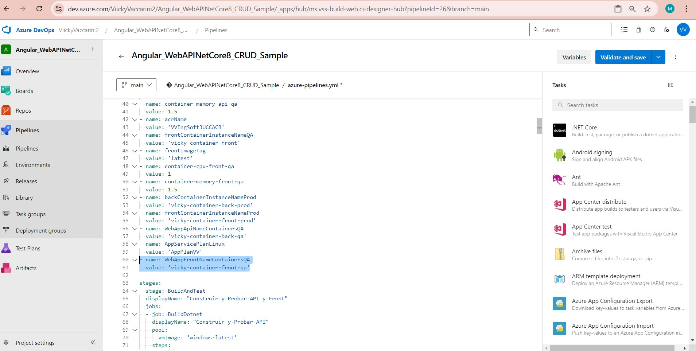
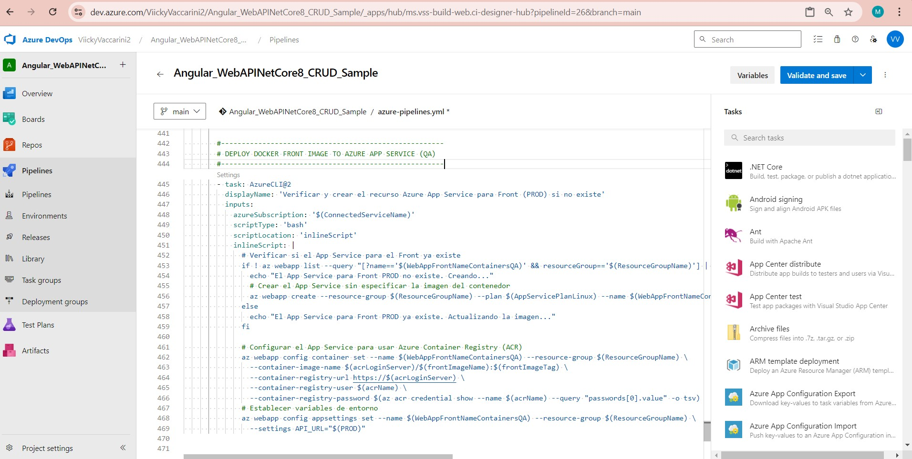
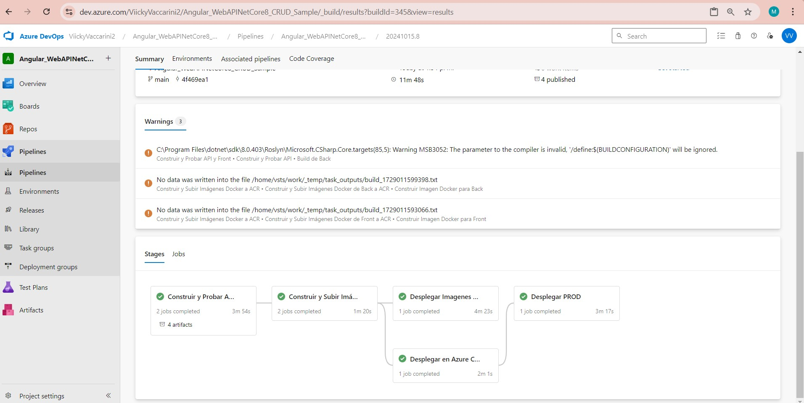
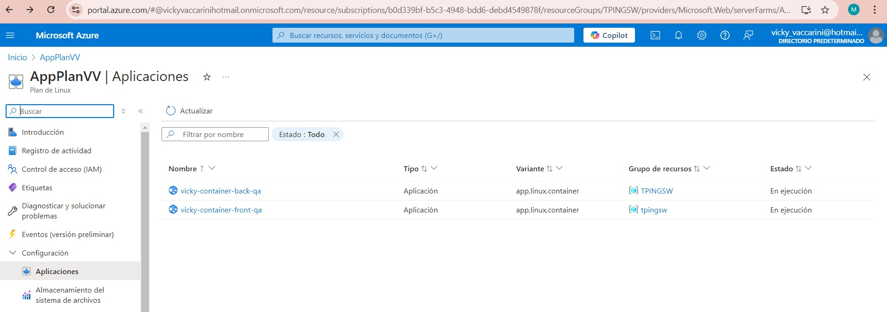
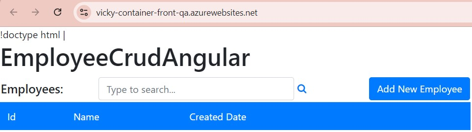

##### 2. Agregar variables necesarias para el funcionamiento de la nueva etapa considerando que debe haber 2 entornos QA y PROD para Back y Front.
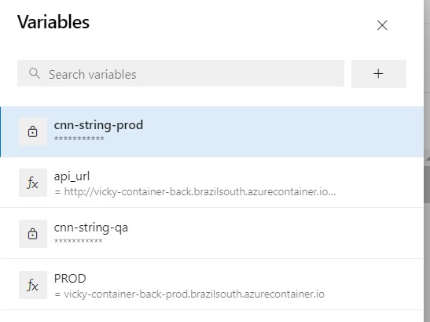

##### 3. Agregar tareas para correr pruebas de integración en el entorno de QA de Back y Front creado en Azure App Services con Soporte para Contenedores.
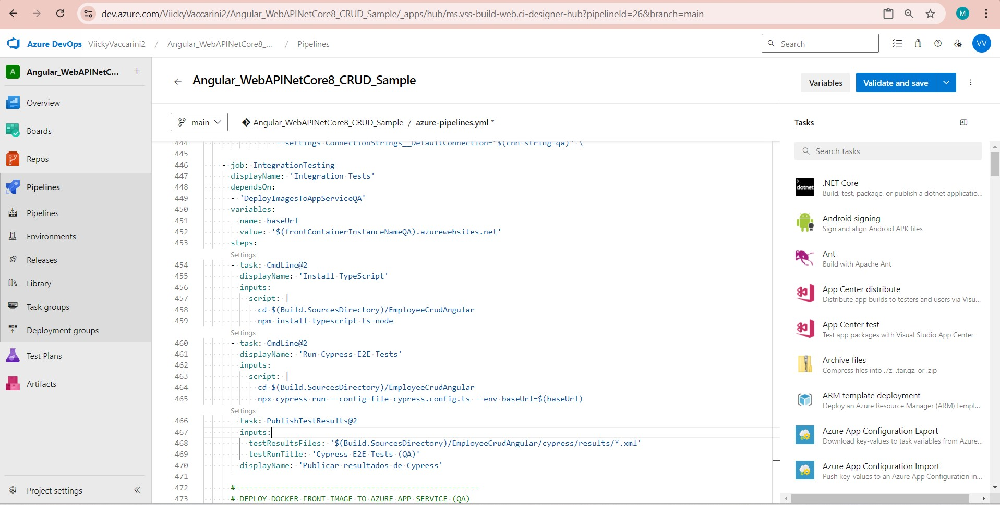

##### 4. Agregar etapa que dependa de la etapa de Deploy en QA que genere un entorno de PROD.
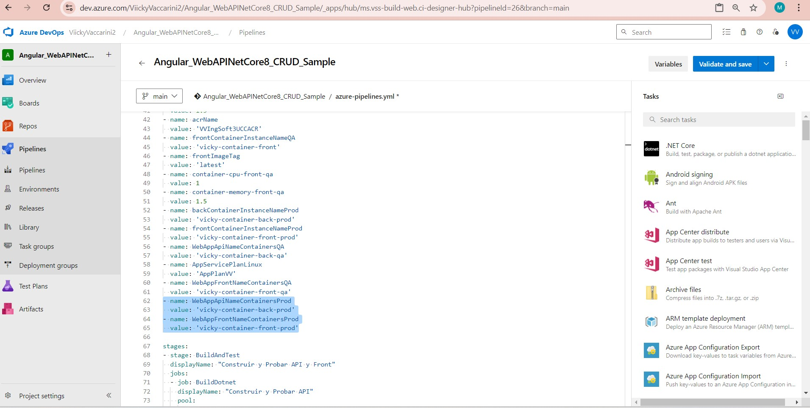
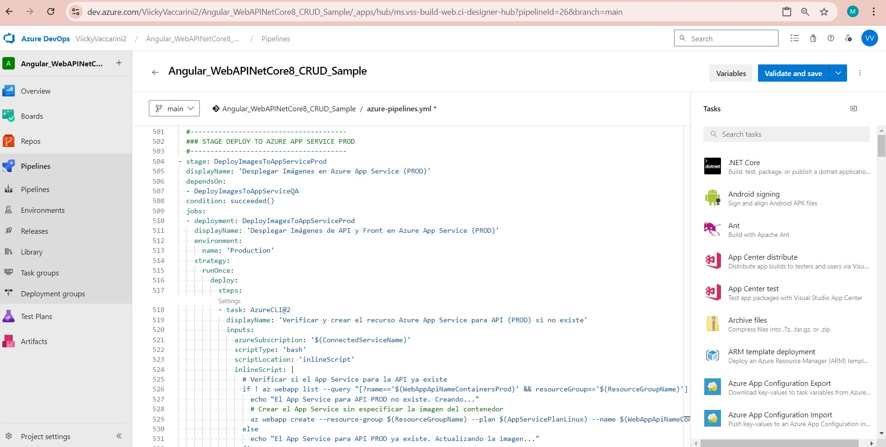
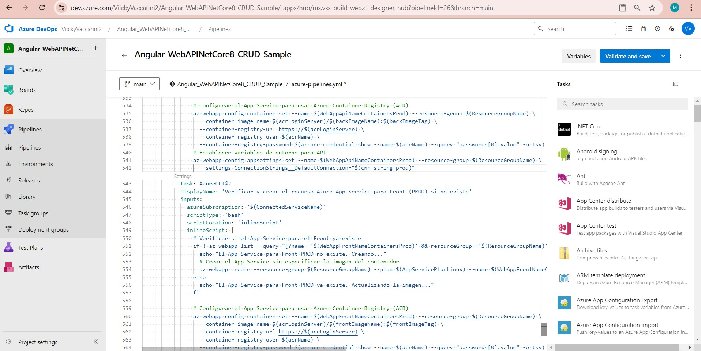
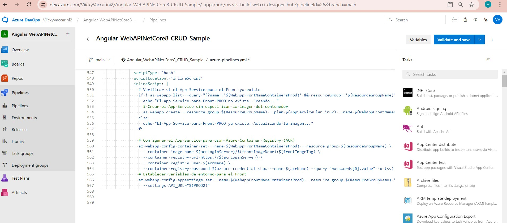

##### 5. Entregar un pipeline que incluya:
##### - Etapa Construcción y Pruebas Unitarias y Code Coverage Back y Front
##### - Construcción de Imágenes Docker y subida a ACR
##### - Deploy Back y Front en QA con pruebas de integración para Azure Web Apps
##### - Deploy Back y Front en QA con pruebas de integración para ACI
##### - Deploy Back y Front en QA con pruebas de integración para Azure Web Apps con Soporte para contenedores
##### - Aprobación manual de QA para los puntos C,D,E
##### - Deploy Back y Front en PROD para Azure Web Apps
##### - Deploy Back y Front en PROD para ACI
##### - Deploy Back y Front en PROD para Azure Web Apps con Soporte para contenedores
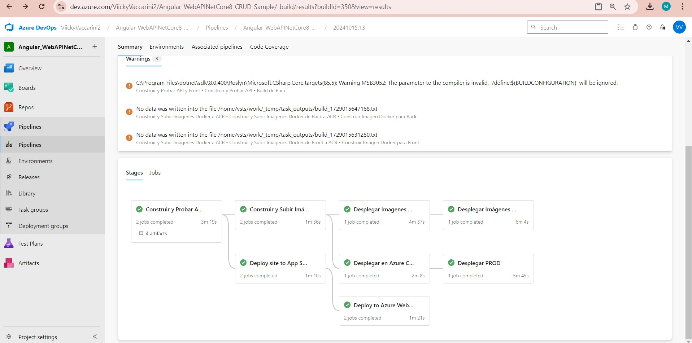

##### PIPELINE COMPLETO:

```yaml
trigger:
  branches:
    include:
    - main
pool:
  vmImage: 'windows-latest'
variables:
- name: configuration
  value: 'Release'
- name: buildOutput
  value: '$(Build.ArtifactStagingDirectory)'
- name: solution
  value: '**/*.sln'
- name: buildPlatform
  value: 'Any CPU'
- name: frontPath
  value: './EmployeeCrudAngular/EmployeeCrudAngular/EmployeeCrudAngular'
- name: backPath
  value: './EmployeeCrudApi'
- name: nodeVersion
  value: '18.x'
- name: ConnectedServiceName
  value: 'Azure Subscription 1'
- name: acrLoginServer
  value: 'vvingsoft3uccacr.azurecr.io'
- name: backImageName
  value: 'miwebapp'
- name: frontImageName
  value: 'miwebapp-prod'
- name: projectPath
  value: 'EmployeeCrudAngular'
- name: ResourceGroupName
  value: 'TPINGSW'
- name: backContainerInstanceNameQA
  value: 'vicky-container-back'
- name: backImageTag
  value: 'latest'
- name: container-cpu-api-qa
  value: 1
- name: container-memory-api-qa
  value: 1.5
- name: acrName
  value: 'VVIngSoft3UCCACR'
- name: frontContainerInstanceNameQA
  value: 'vicky-container-front'
- name: frontImageTag
  value: 'latest'
- name: container-cpu-front-qa
  value: 1
- name: container-memory-front-qa
  value: 1.5
- name: backContainerInstanceNameProd
  value: 'vicky-container-back-prod'
- name: frontContainerInstanceNameProd
  value: 'vicky-container-front-prod'
- name: WebAppApiNameContainersQA
  value: 'vicky-container-back-qa'
- name: AppServicePlanLinux
  value: 'AppPlanVV'
- name: WebAppFrontNameContainersQA
  value: 'vicky-container-front-qa'
- name: WebAppApiNameContainersProd
  value: 'vicky-container-back-prod'
- name: WebAppFrontNameContainersProd
  value: 'vicky-container-front-prod'

stages:
- stage: BuildAndTest
  displayName: "Construir y Probar API y Front"
  jobs:
  - job: BuildDotnet
    displayName: "Construir y Probar API"
    pool:
      vmImage: 'windows-latest'
    steps:
    - task: DotNetCoreCLI@2
      displayName: 'Restaurar paquetes NuGet'
      inputs:
        command: restore
        projects: '$(solution)'
    - task: DotNetCoreCLI@2
      displayName: 'Build de Back'
      inputs:
        command: 'build'
        projects: 'EmployeeCrudApi/EmployeeCrudApi/EmployeeCrudApi.csproj'
        arguments: '--configuration $(buildConfiguration) --output $(buildOutput)/api  --self-contained false'
    - task: DotNetCoreCLI@2
      displayName: 'Publicar Back-End'
      inputs:
        command: publish
        publishWebProjects: true
        arguments: '--configuration $(buildConfiguration) --output $(Build.ArtifactStagingDirectory)'
        zipAfterPublish: true
    - task: PublishBuildArtifacts@1
      displayName: 'Publicar Artefactos de Back'
      inputs:
        pathtoPublish: '$(buildOutput)'
        artifactName: 'drop-back'
        publishLocation: 'Container'
    - task: PublishPipelineArtifact@1
      displayName: 'Publicar Dockerfile de Back'
      inputs:
        targetPath: '$(Build.SourcesDirectory)/docker/api/dockerfile'
        artifact: 'dockerfile-back'
  - job: Frontend
    displayName: 'Build y Análisis del Front-End'
    steps:
    - task: NodeTool@0
      inputs:
        versionSpec: '18.x'
      displayName: 'Instalar Node.js'
    - task: Cache@2
      inputs:
        key: 'npm | "$(Agent.OS)" | EmployeeCrudAngular/package-lock.json'
        path: 'EmployeeCrudAngular/EmployeeCrudAngular/EmployeeCrudAngular/node_modules'
        restoreKeys: |
          npm | "$(Agent.OS)"
      displayName: 'Cachear dependencias de npm'
    - task: CmdLine@2
      displayName: 'Instalar Dependencias de Front'
      inputs:
        script: npm install
        workingDirectory: '$(frontPath)'
    - task: CmdLine@2
      displayName: 'Build de Front'
      condition: succeeded()
      inputs:
        script: npx ng build --configuration production
        workingDirectory: '$(frontPath)'
    - task: PublishBuildArtifacts@1
      displayName: 'Publicar Artefactos de Front'
      inputs:
        pathtoPublish: '$(frontPath)/dist/employee-crud-angular/browser'
        artifactName: 'drop-front'
        publishLocation: 'Container'
    - task: PublishPipelineArtifact@1
      displayName: 'Publicar Dockerfile de Front'
      inputs:
        targetPath: '$(Build.SourcesDirectory)/docker/front/dockerfile'
        artifact: 'dockerfile-front'

- stage: DockerBuildAndPush
  displayName: 'Construir y Subir Imágenes Docker a ACR'
  dependsOn:

  - BuildAndTest
  jobs:
  - job: docker_build_and_push
    displayName: 'Construir y Subir Imágenes Docker de Back a ACR'
    pool:
      vmImage: 'ubuntu-latest'
    steps:
    - task: DownloadPipelineArtifact@2
      displayName: 'Descargar Artefactos de Back'
      inputs:
        buildType: 'current'
        artifactName: 'drop-back'
        targetPath: '$(Pipeline.Workspace)/drop-back'
    - task: DownloadPipelineArtifact@2
      displayName: 'Descargar Dockerfile de Back'
      inputs:
        buildType: 'current'
        artifactName: 'dockerfile-back'
        targetPath: '$(Pipeline.Workspace)/dockerfile-back'
    - task: AzureCLI@2
      displayName: 'Iniciar Sesión en Azure Container Registry (ACR)'
      inputs:
        azureSubscription: '$(ConnectedServiceName)'
        scriptType: bash
        scriptLocation: inlineScript
        inlineScript: |
          az acr login --name $(acrLoginServer)
    - task: Docker@2
      displayName: 'Construir Imagen Docker para Back'
      inputs:
        command: build
        repository: $(acrLoginServer)/$(backImageName)
        dockerfile: $(Pipeline.Workspace)/dockerfile-back/dockerfile
        buildContext: $(Pipeline.Workspace)/drop-back
        tags: 'latest'
    - task: Docker@2
      displayName: 'Subir Imagen Docker de Back a ACR'
      inputs:
        command: push
        repository: $(acrLoginServer)/$(backImageName)
        tags: 'latest'

  - job: docker_build_and_push_front
    displayName: 'Construir y Subir Imágenes Docker de Front a ACR'
    pool:
      vmImage: 'ubuntu-latest'
    steps:
    - task: DownloadPipelineArtifact@2
      displayName: 'Descargar Artefactos de Front'
      inputs:
        buildType: 'current'
        artifactName: 'drop-front'
        targetPath: '$(Pipeline.Workspace)/drop-front'
    - task: DownloadPipelineArtifact@2
      displayName: 'Descargar Dockerfile de Front'
      inputs:
        buildType: 'current'
        artifactName: 'dockerfile-front'
        targetPath: '$(Pipeline.Workspace)/dockerfile-front'
    - task: AzureCLI@2
      displayName: 'Iniciar Sesión en Azure Container Registry (ACR)'
      inputs:
        azureSubscription: '$(ConnectedServiceName)'
        scriptType: bash
        scriptLocation: inlineScript
        inlineScript: |
          az acr login --name $(acrLoginServer)
    - task: Docker@2
      displayName: 'Construir Imagen Docker para Front'
      inputs:
        command: build
        repository: $(acrLoginServer)/$(frontImageName)
        dockerfile: $(Pipeline.Workspace)/dockerfile-front/dockerfile
        buildContext: $(Pipeline.Workspace)/drop-front
        tags: 'latest'
    - task: Docker@2
      displayName: 'Subir Imagen Docker de Front a ACR'
      inputs:
        command: push
        repository: $(acrLoginServer)/$(frontImageName)
        tags: 'latest'

# Deploy App Services
- stage: DeployAppServices
  displayName: 'Deploy site to App Services (QA)'
  dependsOn:
  - BuildAndTest
  condition: succeeded()
  pool:
    vmImage: 'windows-latest'
  jobs:
  - job: DeployBack
    displayName: 'Deploy Backend'
    steps:
    - task: DownloadBuildArtifacts@1
      inputs:
        buildType: 'current'
        downloadType: 'single'
        artifactName: 'drop-back'
        downloadPath: '$(System.ArtifactsDirectory)'
    - task: CmdLine@2
      displayName: 'Listar archivos generados del Frontend'
      inputs:
        script: ls -R $(System.ArtifactsDirectory)
    - task: AzureRmWebAppDeployment@4
      inputs:
        azureSubscription: 'Azure subscription 1'
        appType: 'webApp'
        WebAppName: 'MiWebApp1'
        package: '$(System.ArtifactsDirectory)/drop-back/**/*.zip'

  - job: DeployFront
    displayName: 'Deploy Frontend'
    steps:
    - task: DownloadBuildArtifacts@1
      inputs:
        buildType: 'current'
        downloadType: 'single'
        artifactName: 'drop-front'
        downloadPath: '$(System.ArtifactsDirectory)'
    - task: AzureRmWebAppDeployment@4
      inputs:
        azureSubscription: 'Azure subscription 1'
        appType: 'webApp'
        WebAppName: 'MiWebApp1-prod'
        package: '$(System.ArtifactsDirectory)/drop-front'

# Desplegar en Azure Container Instances (ACI) QA
- stage: DeployToACIQA
  displayName: 'Desplegar en Azure Container Instances (ACI) QA'
  dependsOn:
  - DockerBuildAndPush
  jobs:
  - job: deploy_to_aci_qa
    displayName: 'Desplegar en Azure Container Instances (ACI) QA'
    pool:
      vmImage: 'ubuntu-latest'
    steps:
    - task: AzureCLI@2
      displayName: 'Desplegar Imagen Docker de Back en ACI QA'
      inputs:
        azureSubscription: '$(ConnectedServiceName)'
        scriptType: bash
        scriptLocation: inlineScript
        inlineScript: |
          echo "Resource Group: $(ResourceGroupName)"
          echo "Container Instance Name: $(backContainerInstanceNameQA)"
          echo "ACR Login Server: $(acrLoginServer)"
          echo "Image Name: $(backImageName)"
          echo "Image Tag: $(backImageTag)"
          echo "Connection String: $(cnn-string-qa)"

          az container delete --resource-group $(ResourceGroupName) --name $(backContainerInstanceNameQA) --yes

          az container create --resource-group $(ResourceGroupName) \
            --name $(backContainerInstanceNameQA) \
            --image $(acrLoginServer)/$(backImageName):$(backImageTag) \
            --registry-login-server $(acrLoginServer) \
            --registry-username $(acrName) \
            --registry-password $(az acr credential show --name $(acrName) --query "passwords[0].value" -o tsv) \
            --dns-name-label $(backContainerInstanceNameQA) \
            --ports 80 \
            --environment-variables ConnectionStrings__DefaultConnection="$(cnn-string-qa)" \
            --restart-policy Always \
            --cpu $(container-cpu-api-qa) \
            --memory $(container-memory-api-qa)
  
    - task: AzureCLI@2
      displayName: 'Desplegar Imagen Docker de Front en ACI QA'
      inputs:
        azureSubscription: '$(ConnectedServiceName)'
        scriptType: bash
        scriptLocation: inlineScript
        inlineScript: |
          echo "Resource Group: $(ResourceGroupName)"
          echo "Container Instance Name: $(frontContainerInstanceNameQA)"
          echo "ACR Login Server: $(acrLoginServer)"
          echo "Image Name: $(frontImageName)"
          echo "Image Tag: $(frontImageTag)"
          echo "Api Url: $(api_url)"

          az container delete --resource-group $(ResourceGroupName) --name $(frontContainerInstanceNameQA) --yes

          az container create --resource-group $(ResourceGroupName) \
            --name $(frontContainerInstanceNameQA) \
            --image $(acrLoginServer)/$(frontImageName):$(frontImageTag) \
            --registry-login-server $(acrLoginServer) \
            --registry-username $(acrName) \
            --registry-password $(az acr credential show --name $(acrName) --query "passwords[0].value" -o tsv) \
            --dns-name-label $(frontContainerInstanceNameQA) \
            --ports 80 \
            --environment-variables api_url="$(api_url)" \
            --restart-policy Always \
            --cpu $(container-cpu-front-qa) \
            --memory $(container-memory-front-qa)

  - job: IntegrationTesting
    displayName: 'Cypress'
    dependsOn: deploy_to_aci_qa
    variables:
      - name: baseUrl
        value: '$(frontContainerInstanceNameQA).eastus.azurecontainer.io'

    steps:
      - script: |
          cd $(Build.SourcesDirectory)/EmployeeCrudAngular
          npm install typescript ts-node
        displayName: 'Install TypeScript'

      # Crear la carpeta results si no existe
      - script: |
          mkdir $(Build.SourcesDirectory)\EmployeeCrudAngular\EmployeeCrudAngular\EmployeeCrudAngular\cypress\results
        displayName: 'Create Results Directory'

      - script: |
          cd $(Build.SourcesDirectory)/EmployeeCrudAngular/EmployeeCrudAngular/EmployeeCrudAngular
          npx cypress run --config-file cypress.config.ts --env baseUrl=$(baseUrl)
        displayName: 'Run Cypress E2E Tests'

      - task: PublishTestResults@2
        inputs:
          testResultsFiles: '$(Build.SourcesDirectory)/EmployeeCrudAngular/EmployeeCrudAngular/EmployeeCrudAngular/cypress/results/*.xml'
          testRunTitle: 'Cypress E2E Tests (QA)'
        displayName: 'Publish Cypress Test Results'

  #---------------------------------------
  ### STAGE DEPLOY TO AZURE APP SERVICE QA
  #---------------------------------------
- stage: DeployImagesToAppServiceQA
  displayName: 'Desplegar Imagenes en Azure App Service (QA)'
  dependsOn: 
  - BuildAndTest
  - DockerBuildAndPush
  condition: succeeded()
  jobs:
    - job: DeployImagesToAppServiceQA
      displayName: 'Desplegar Imagenes de API y Front en Azure App Service (QA)'
      pool:
        vmImage: 'ubuntu-latest'
      steps:
        #------------------------------------------------------
        # DEPLOY DOCKER API IMAGE TO AZURE APP SERVICE (QA)
        #------------------------------------------------------
        - task: AzureCLI@2
          displayName: 'Verificar y crear el recurso Azure App Service para API (QA) si no existe'
          inputs:
            azureSubscription: '$(ConnectedServiceName)'
            scriptType: 'bash'
            scriptLocation: 'inlineScript'
            inlineScript: |
              # Verificar si el App Service para la API ya existe
              if ! az webapp list --query "[?name=='$(WebAppApiNameContainersQA)' && resourceGroup=='$(ResourceGroupName)'] | length(@)" -o tsv | grep -q '^1$'; then
                echo "El App Service para API QA no existe. Creando..."
                # Crear el App Service sin especificar la imagen del contenedor
                az webapp create --resource-group $(ResourceGroupName) --plan $(AppServicePlanLinux) --name $(WebAppApiNameContainersQA) --deployment-container-image-name "nginx"  # Especifica una imagen temporal para permitir la creación
              else
                echo "El App Service para API QA ya existe. Actualizando la imagen..."
              fi

              # Configurar el App Service para usar Azure Container Registry (ACR)
              az webapp config container set --name $(WebAppApiNameContainersQA) --resource-group $(ResourceGroupName) \
                --container-image-name $(acrLoginServer)/$(backImageName):$(backImageTag) \
                --container-registry-url https://$(acrLoginServer) \
                --container-registry-user $(acrName) \
                --container-registry-password $(az acr credential show --name $(acrName) --query "passwords[0].value" -o tsv)
              # Establecer variables de entorno
              az webapp config appsettings set --name $(WebAppApiNameContainersQA) --resource-group $(ResourceGroupName) \
                --settings ConnectionStrings__DefaultConnection="$(cnn-string-qa)" \

  - job: IntegrationTesting
    displayName: 'Integration Tests'
    dependsOn:
    - 'DeployImagesToAppServiceQA'
    variables:
    - name: baseUrl
      value: '$(frontContainerInstanceNameQA).azurewebsites.net'
    steps:
    - task: CmdLine@2
      displayName: 'Install TypeScript'
      inputs:
        script: |
          cd $(Build.SourcesDirectory)\EmployeeCrudAngular\EmployeeCrudAngular\EmployeeCrudAngular\cypress\results
          npm install typescript ts-node
    - task: CmdLine@2
      displayName: 'Run Cypress E2E Tests'
      inputs:
        script: |
          cd $(Build.SourcesDirectory)/EmployeeCrudAngular
          npx cypress run --config-file cypress.config.ts --env baseUrl=$(baseUrl)
    - task: PublishTestResults@2
      inputs:
        testResultsFiles: '$(Build.SourcesDirectory)/EmployeeCrudAngular/EmployeeCrudAngular/EmployeeCrudAngular/cypress/results/*.xml'
        testRunTitle: 'Cypress E2E Tests (QA)'
      displayName: 'Publicar resultados de Cypress'

        #------------------------------------------------------
        # DEPLOY DOCKER FRONT IMAGE TO AZURE APP SERVICE (QA)
        #------------------------------------------------------
        - task: AzureCLI@2
          displayName: 'Verificar y crear el recurso Azure App Service para Front (PROD) si no existe'
          inputs:
            azureSubscription: '$(ConnectedServiceName)'
            scriptType: 'bash'
            scriptLocation: 'inlineScript'
            inlineScript: |
              # Verificar si el App Service para el Front ya existe
              if ! az webapp list --query "[?name=='$(WebAppFrontNameContainersQA)' && resourceGroup=='$(ResourceGroupName)'] | length(@)" -o tsv | grep -q '^1$'; then
                echo "El App Service para Front PROD no existe. Creando..."
                # Crear el App Service sin especificar la imagen del contenedor
                az webapp create --resource-group $(ResourceGroupName) --plan $(AppServicePlanLinux) --name $(WebAppFrontNameContainersQA) --deployment-container-image-name "nginx"  # Especifica una imagen temporal para permitir la creación
              else
                echo "El App Service para Front PROD ya existe. Actualizando la imagen..."
              fi

              # Configurar el App Service para usar Azure Container Registry (ACR)
              az webapp config container set --name $(WebAppFrontNameContainersQA) --resource-group $(ResourceGroupName) \
                --container-image-name $(acrLoginServer)/$(frontImageName):$(frontImageTag) \
                --container-registry-url https://$(acrLoginServer) \
                --container-registry-user $(acrName) \
                --container-registry-password $(az acr credential show --name $(acrName) --query "passwords[0].value" -o tsv)
              # Establecer variables de entorno
              az webapp config appsettings set --name $(WebAppFrontNameContainersQA) --resource-group $(ResourceGroupName) \
                --settings API_URL="$(PROD)"

- stage: DeployToProdWebApps
  displayName: 'Deploy to Azure Web Apps (Production)'
  dependsOn:
  - 'DeployAppServices'
  condition: succeeded()
  jobs:
  - deployment: DeployBackProd
    displayName: 'Deploy Backend to Production'
    environment:
      name: 'Production'
    strategy:
      runOnce:
        deploy:
          steps:
          - task: DownloadBuildArtifacts@1
            inputs:
              buildType: 'current'
              downloadType: 'single'
              artifactName: 'drop-back'
              downloadPath: '$(System.ArtifactsDirectory)'
          - task: AzureRmWebAppDeployment@4
            inputs:
              azureSubscription: '$(ConnectedServiceName)'
              appType: 'webApp'
              WebAppName: 'MiWebApp1-Prod'
              package: '$(System.ArtifactsDirectory)/drop-back/**/*.zip'
  - job: DeployFrontProd
    displayName: 'Deploy Frontend to Production'
    steps:
    - task: DownloadBuildArtifacts@1
      inputs:
        buildType: 'current'
        downloadType: 'single'
        artifactName: 'drop-front'
        downloadPath: '$(System.ArtifactsDirectory)'
    - task: AzureRmWebAppDeployment@4
      inputs:
        azureSubscription: '$(ConnectedServiceName)'
        appType: 'webApp'
        WebAppName: 'MiWebApp1-prod'
        package: '$(System.ArtifactsDirectory)/drop-front'

# DEPLOY A PROD
- stage: DeployToACIPROD
  displayName: 'Desplegar PROD'
  dependsOn:
  - DeployToACIQA
  jobs:
  - deployment: DeployToProd
    displayName: 'Desplegar PRODD'
    environment:
      name: 'Production'
    strategy:
      runOnce:
        deploy:
          steps:
      
        # BACK
          - task: AzureCLI@2
            displayName: 'Desplegar Imagen Docker de Back en ACI (Prod)'
            inputs:
              azureSubscription: '$(ConnectedServiceName)'
              scriptType: bash
              scriptLocation: inlineScript
              inlineScript: |
                echo "Resource Group: $(ResourceGroupName)"
                echo "Container Instance Name: $(backContainerInstanceNameProd)"
                echo "ACR Login Server: $(acrLoginServer)"
                echo "Image Name: $(backImageName)"
                echo "Image Tag: $(backImageTag)"
                echo "Connection String: $(cnn-string-prod)"

                az container delete --resource-group $(ResourceGroupName) --name $(backContainerInstanceNameProd) --yes

                az container create --resource-group $(ResourceGroupName) \
                  --name $(backContainerInstanceNameProd) \
                  --image $(acrLoginServer)/$(backImageName):$(backImageTag) \
                  --registry-login-server $(acrLoginServer) \
                  --registry-username $(acrName) \
                  --registry-password $(az acr credential show --name $(acrName) --query "passwords[0].value" -o tsv) \
                  --dns-name-label $(backContainerInstanceNameProd) \
                  --ports 80 \
                  --environment-variables ConnectionStrings__DefaultConnection="$(cnn-string-prod)" \
                  --restart-policy Always \
                  --cpu $(container-cpu-api-qa) \
                  --memory $(container-memory-api-qa)
          
        # FRONT
          - task: AzureCLI@2
            displayName: 'Desplegar Imagen Docker de Front en ACI (PROD)'
            inputs:
              azureSubscription: '$(ConnectedServiceName)'
              scriptType: bash
              scriptLocation: inlineScript
              inlineScript: |
                echo "Resource Group: $(ResourceGroupName)"
                echo "Container Instance Name: $(frontContainerInstanceNameProd)"
                echo "ACR Login Server: $(acrLoginServer)"
                echo "Image Name: $(frontImageName)"
                echo "Image Tag: $(frontImageTag)"
                echo "API URL: $(PROD)"

                az container delete --resource-group $(ResourceGroupName) --name $(frontContainerInstanceNameProd) --yes

                az container create --resource-group $(ResourceGroupName) \
                  --name $(frontContainerInstanceNameProd) \
                  --image $(acrLoginServer)/$(frontImageName):$(frontImageTag) \
                  --registry-login-server $(acrLoginServer) \
                  --registry-username $(acrName) \
                  --registry-password $(az acr credential show --name $(acrName) --query "passwords[0].value" -o tsv) \
                  --dns-name-label $(frontContainerInstanceNameProd) \
                  --ports 80 \
                  --environment-variables API_URL="$(PROD)" \
                  --restart-policy Always \
                  --cpu $(container-cpu-front-qa) \
                  --memory $(container-memory-front-qa)


  #---------------------------------------
  ### STAGE DEPLOY TO AZURE APP SERVICE PROD
  #---------------------------------------
- stage: DeployImagesToAppServiceProd
  displayName: 'Desplegar Imágenes en Azure App Service (PROD)'
  dependsOn:
  - DeployImagesToAppServiceQA
  condition: succeeded()
  jobs:
  - deployment: DeployImagesToAppServiceProd
    displayName: 'Desplegar Imágenes de API y Front en Azure App Service (PROD)'
    environment:
      name: 'Production'
    strategy:
      runOnce:
        deploy:
          steps:
          - task: AzureCLI@2
            displayName: 'Verificar y crear el recurso Azure App Service para API (PROD) si no existe'
            inputs:
              azureSubscription: '$(ConnectedServiceName)'
              scriptType: 'bash'
              scriptLocation: 'inlineScript'
              inlineScript: |
                # Verificar si el App Service para la API ya existe
                if ! az webapp list --query "[?name=='$(WebAppApiNameContainersProd)' && resourceGroup=='$(ResourceGroupName)'] | length(@)" -o tsv | grep -q '^1$'; then
                  echo "El App Service para API PROD no existe. Creando..."
                  # Crear el App Service sin especificar la imagen del contenedor
                  az webapp create --resource-group $(ResourceGroupName) --plan $(AppServicePlanLinux) --name $(WebAppApiNameContainersProd) --deployment-container-image-name "nginx"  # Especifica una imagen temporal para permitir la creación
                else
                  echo "El App Service para API PROD ya existe. Actualizando la imagen..."
                fi

                # Configurar el App Service para usar Azure Container Registry (ACR)
                az webapp config container set --name $(WebAppApiNameContainersProd) --resource-group $(ResourceGroupName) \
                  --container-image-name $(acrLoginServer)/$(backImageName):$(backImageTag) \
                  --container-registry-url https://$(acrLoginServer) \
                  --container-registry-user $(acrName) \
                  --container-registry-password $(az acr credential show --name $(acrName) --query "passwords[0].value" -o tsv)
                # Establecer variables de entorno para API
                az webapp config appsettings set --name $(WebAppApiNameContainersProd) --resource-group $(ResourceGroupName) \
                  --settings ConnectionStrings__DefaultConnection="$(cnn-string-prod)"
          - task: AzureCLI@2
            displayName: 'Verificar y crear el recurso Azure App Service para Front (PROD) si no existe'
            inputs:
              azureSubscription: '$(ConnectedServiceName)'
              scriptType: 'bash'
              scriptLocation: 'inlineScript'
              inlineScript: |
                # Verificar si el App Service para el Front ya existe
                if ! az webapp list --query "[?name=='$(WebAppFrontNameContainersProd)' && resourceGroup=='$(ResourceGroupName)'] | length(@)" -o tsv | grep -q '^1$'; then
                  echo "El App Service para Front PROD no existe. Creando..."
                  # Crear el App Service sin especificar la imagen del contenedor
                  az webapp create --resource-group $(ResourceGroupName) --plan $(AppServicePlanLinux) --name $(WebAppFrontNameContainersProd) --deployment-container-image-name "nginx"  # Especifica una imagen temporal para permitir la creación
                else
                  echo "El App Service para Front PROD ya existe. Actualizando la imagen..."
                fi

                # Configurar el App Service para usar Azure Container Registry (ACR)
                az webapp config container set --name $(WebAppFrontNameContainersProd) --resource-group $(ResourceGroupName) \
                  --container-image-name $(acrLoginServer)/$(frontImageName):$(frontImageTag) \
                  --container-registry-url https://$(acrLoginServer) \
                  --container-registry-user $(acrName) \
                  --container-registry-password $(az acr credential show --name $(acrName) --query "passwords[0].value" -o tsv)
                # Establecer variables de entorno para el Front
                az webapp config appsettings set --name $(WebAppFrontNameContainersProd) --resource-group $(ResourceGroupName) \
                  --settings API_URL="$(PROD2)"


